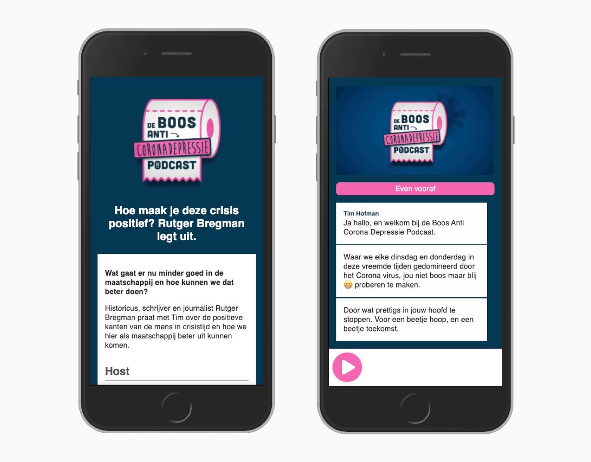

# Web Design @cmda-minor-web 1920
**How can you make a podcast more interesting for someone who's Deaf.**

## Table of contents
- [Case](#case)
    - [Marie](#marie)
    - [Proces](#proces)
- [Installation](#installation)
    - [Creating your own transcript](#creating-your-own-transcript)
- [License](#license)

## Case:
School asked me the question how can we make podcasts a lot more interesting for people who are Deaf. In particular one person:

### Marie
Marie van Driessche is Deaf. With a capital D, that means sign language is her native language. The assignment is to tune the podcast to her liking.

### Proces
How'd go? Check it my [weekly logs](https://github.com/gijslaarman/web-design-1920/wiki).

### Room for nonsense
Why so serious? Adding a little smiley/emoji here and there, or inserting a funny image/gif in the transcript lightens up the mood a bit :). Give the user a break with a pause moment with your funny text inside. In short: The podcast doesn't need to be only just text, the visuals make it fun and way more playful whilst stupidly hilarious sometimes! (Look I know in the current demo there's no funny gif, but imagine there would be one).

## Demo

     
> Left side: First view, small summary to see if the podcast is worth your time.
> Right side: Podcast in action but paused.

[Click here for the demo](https://gijslaarman.github.io/web-design-1920)

## Installation
Copy & paste:
```
git clone https://github.com/gijslaarman/web-design-1920.git && cd web-design-1920
```

That's all. This is build in vanilla js.

---

## Creating your own transcript
I've created a little javascript engine that loads up the JSON file and renders it into a podcast. You can easily create your own. The engine will take in consideration:

- The amount of words there are and how long it needs to wait for the next message to show based on a variable. The standard is 200ms per word (WIP: but in the control panel you can adjust the wordspeed by a 50ms interval, based on users preference).
- Pause the podcast at any time if you wanna re-read a section again.
- Choose between 3 different type of blocks you can use:
    - A message
    - A pause
    - An image/gif.
- Easily add hosts to your podcast.

Take a look at the example. All the data is super easy to adjust, and I'm sure you understand it directly. An example is in the [podcast.json](https://github.com/gijslaarman/web-design-1920/blob/master/podcast.json).

Edit it to your liking and the engine will take care of the rest ;). Disclaimer: Put the blocks in chronological order (top to bottom).

Current working blocks:
```json
// Text message
{
    "type": "message",
    "talking": "<name_of_one_of_the_hosts>",
    "message": "<your_message_goes_here>"
},

{
    "type": "pause",
    "length": 2000, // Number in milliseconds.
    "message": "<your_mesage_goes_here>" // Text inside the pause block.
},

{
    "type": "image",
    "imageSrc": "./img/test.gif", // Image source.
    "imageName": "intro", // Alt text
    "length": 4000 // Time before next block appears.
},
```

## License
MIT free to use. [License](https://github.com/gijslaarman/web-design-1920/blob/master/LICENSE)
